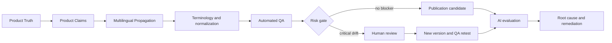

# Multilingual Product Knowledge Integrity Lab

A reference implementation for preserving product knowledge integrity across multilingual content, AI-assisted translation, and downstream AI systems.

An AI can give a factually wrong answer while faithfully repeating incorrect published product information. This project separates Product Truth, published multilingual content, observed AI output, source integrity, model fidelity, and end-to-end factual integrity.



## Core idea

Product Truth is the canonical structured record. A Product Claim is one stable, auditable fact such as `input_phase_count = 1 phase`. Language-specific surface forms can differ while representing the same claim. QA compares structured facts instead of one preferred sentence.

The fictional NexaVolt PSX-24010 walkthrough intentionally publishes an Italian three-phase claim while Product Truth requires one phase. Automated QA blocks it, the deterministic AI observation repeats it, root cause identifies `PUBLISHED_VARIANT_DRIFT`, and a new Italian `1.0.1` version passes the retest.

## Quickstart: no API key required

```bash
python -m pip install -e ".[dev]"
product-knowledge-integrity --dataset examples/nexavolt_psx_24010 --phase baseline
product-knowledge-integrity --dataset examples/nexavolt_psx_24010 --phase retest
python -m pytest -q
```

The baseline should show a blocked publication gate and one source-layer root cause. The retest should pass.

## Optional OpenAI use

Copy `.env.example` to `.env`, provide your own key, and explicitly call the optional adapter from your own experiment. It uses a certifi-backed TLS context and `store: false`. No paid call is needed for the tutorial, tests, or curated reports; no historical provider response is bundled.

## What this project is not

It is not a TMS, PIM, GEO platform, AI visibility tool, LLM benchmark, or production-ready enterprise platform. It is a small reference implementation for multilingual Product Knowledge Integrity.

## Structure

- `examples/` — fictional NexaVolt data and language-operation contracts.
- `reports/examples/` — curated deterministic educational artifacts, not raw API captures.
- `src/` — generic Product Truth, QA, review, evaluation, and optional provider code.
- `docs/` — architecture and tutorial.

See [the tutorial](docs/TUTORIAL.md), [open-source boundary](docs/OPEN_SOURCE_BOUNDARY.md), and [human review model](docs/HUMAN_REVIEW.md).

Created by Dina Nicolorich as part of the Verbinex research on Multilingual Product Knowledge & AI Integrity.

Licensed under Apache-2.0.
